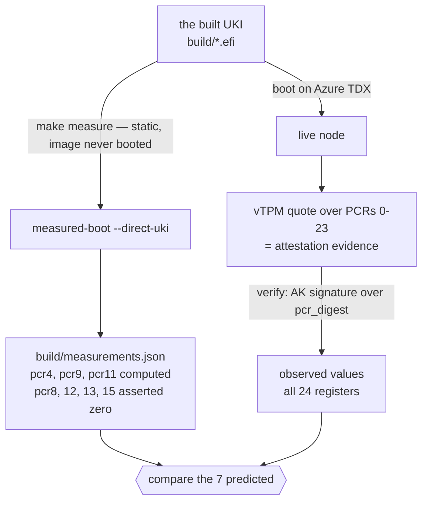

# Azure guest measurements

A Seismic node's guest identity on Azure TDX is the tuple
**`(pcr4, pcr9, pcr11)`**. This document is the empirical basis for that
choice: what a node's boot measures, what each register covers, and why the
other 21 registers stay out. The boot path it describes is the one this repo
builds — [`shared/`](../shared/) plus [`modules/seismic/`](../modules/seismic/)
plus the selected profile. The normative rules that consume it — the
schema, admission-ID derivation, and registry storage — are in the
[measurement-admission specification](https://github.com/SeismicSystems/enclave/blob/seismic/crates/measurement-admission/SPEC.md),
and how a network pins its first policy document is in
[network founding](https://github.com/SeismicSystems/seismic/blob/main/docs/tee/network-founding.md).

Scope: the Azure TDX + vTPM backend. A different attestation backend (bare
TDX RTMRs, GCP) measures different things and gets its own schema.

Every value here is per build, captured 2026-07-27 from a devtools-profile
image booted as a single root-key genesis node. Devtools adds
`openssh-server`, a serial console, and `ssh.service`, so its initrd differs
from a production image: the structural conclusions carry over between
profiles, the numbers do not.

## The three registers

| Reg   | Covers                                                             | Event log                                                                                                                                                                              |
| ----- | ------------------------------------------------------------------ | -------------------------------------------------------------------------------------------------------------------------------------------------------------------------------------- |
| pcr4  | Boot manager code and the EFI application it loads — the UKI binary | 4 events: `EV_EFI_ACTION` ("Calling EFI Application from Boot Option"), `EV_SEPARATOR`, "Boot Stage 1: Unified Kernel Image (UKI)" (`82b2f8cf…`), "Boot Stage 2: Linux" (`cf993177…`)  |
| pcr9  | Files loaded via LOAD_FILE2 — the cmdline and initrd actually loaded | 2 events: the kernel cmdline (`aa50cea3…`) and the initrd digest (`170cf31e…`)                                                                                                          |
| pcr11 | The UKI sections measured by `systemd-stub` — what the UKI contains  | 12 events: name and data for each of `.linux`, `.osrel`, `.cmdline`, `.initrd`, `.uname`, `.sbat`                                                                                       |

These three registers, and only these three, move when Seismic ships a new
image. The rootfs *is* the UKI's `.initrd` unpacked into tmpfs
([`Format=uki`](../shared/mkosi.conf)), so pcr11 covers the running
filesystem byte for byte.

**pcr9 and pcr11 overlap, and both are needed.** The initrd appears in both
with the *identical* digest `170cf31e…`. The cmdline appears in both with
*different* digests (`aa50cea3…` and `30a47dd0…`), because pcr9 measures the
UTF-16 string actually passed while pcr11 measures the raw section bytes.
pcr11 attests *what the UKI contains*; pcr9 attests *what was actually
loaded*. They diverge exactly when the boot path substitutes a cmdline or
initrd other than the embedded one, which is the case pcr9 exists to catch.

pcr9 cannot vary node to node by configuration: `KernelCommandLine=` is fixed
in [`shared/mkosi.conf`](../shared/mkosi.conf) and baked into the UKI, so
no per-node cmdline delivery exists.

## Predicting and observing

The same image is measured twice, by two paths that never meet until the
values are compared:



The two sides are deliberately different widths. The quote covers all 24 PCRs
— `az-cvm-vtpm`'s `VTPM_QUOTE_PCR_SLOTS` is all 24 SHA-256 slots, and
`Quote::verify_pcrs()` re-hashes the bundled values against the AK-signed
`pcr_digest`, so every register in this document is authenticated rather than
an unverified server claim.

The prediction covers 7 because that is what the tool implements today, not
because 7 is the limit. [`measured-boot`](https://github.com/flashbots/measured-boot)
(pinned to v1.2.0 in [`flake.nix`](../flake.nix)) has simulators for pcr4,
pcr9, and pcr11, and seeds a bank of seven slots — 4, 8, 9, 11, 12, 13, 15 —
so `measurements.json` carries three computed values plus four that assert
nothing extended those slots. The tool prints only six to stderr; pcr8 is in
the JSON but never printed.

Eight registers are unpredictable from an image, and always will be:
pcr0/2/5/6/7 are Azure firmware and platform data, pcr1/3 hold whatever
separator the firmware emits, and pcr10 is written by IMA at runtime. None of
them exist until the image boots on a particular VM.

The other nine are not a prediction problem. pcr14/16/23 are zero and
pcr17–22 are `0xff…ff` by TPM reset semantics on any vTPM, so they are
constants a predictor could assert the same way it already asserts
pcr8/12/13/15 — which would move nine registers from "checked only against a
live quote" to "checked at build time". Nothing does that today.

```bash
# predicted, from this repo's root
make measure FILE=build/<image>.efi        # -> build/measurements.json

# observed, from anywhere that can reach the node (no shell required)
cargo run -p seismic-attestation-service --example capture_measurements -- \
  --url http://<node>:7878 \
  --network-id 0x$(sha256sum network-manifest.json | cut -d' ' -f1) \
  --out-policy /tmp/observed.json

diff <(jq -S . /tmp/observed.json) <(jq -S . build/measurements.json)
```

`capture_measurements` reaches the node over its attestation RPC, which needs
a live custodian — a node that has finished bootstrapping. PCRs are final long
before then, so use `seismic-attestation`'s `azure_vtpm_roundtrip` on-node to
measure a node that never got that far.

**All seven registers `make measure` predicts match the live quote exactly**:
pcr4 `3dd4d386…c7c1ed7f`, pcr9 `d7c9deb1…bf42b7c9`, pcr11
`f31b9510…e55f2ab3`, and pcr8/12/13/15 zero on both sides. This retires the
main risk in a statically predicted policy — see the pcr11 caveat under
[Not yet established](#not-yet-established).

The event log is not in the quote; only final PCR values are. Diagnosing a
mismatch needs `/sys/kernel/security/tpm0/binary_bios_measurements` from the
node, which requires a shell and so is available on a devtools-profile image
only.

## Why the other registers stay out

The full 24-register inventory, and the reason each group is excluded:

| Registers                | State                             | Why not in the tuple                                  |
| ------------------------ | --------------------------------- | ----------------------------------------------------- |
| 0, 2, 5, 7               | content-bearing                   | Azure platform layer — changes without a Seismic release |
| 6                        | content-bearing                   | per-VM instance — see below                           |
| 10                       | content-bearing                   | derived from pcr0–9, per-VM instance — see below      |
| 1, 3                     | `EV_SEPARATOR` only               | informationally empty                                 |
| 8, 12, 13, 14, 15, 16, 23 | all-zero                         | nothing extended them — `make measure` asserts this for 8, 12, 13, 15 |
| 17–22                    | all-`0xff`                        | uninitialized, not measurements                       |

Register assignments for pcr0–7 follow the
[TCG PC Client Platform Firmware Profile](https://trustedcomputinggroup.org/resource/pc-client-specific-platform-firmware-profile-specification/);
pcr8–15 are bootloader and OS conventions rather than TCG-assigned.

Two traps for anything that selects registers automatically:

- **pcr1 and pcr3 are verifiably empty.** Both hold `3d458cfe…198e7969`,
  which is exactly `extend(0, sha256(00000000))` — a single `EV_SEPARATOR`
  and nothing else.
- **pcr17–22 are all-ones, which is not a measurement.** DRTM registers reset
  to `0xff…ff` rather than zero when no dynamic-root-of-trust event occurs.
  Tooling that filters for "non-zero" registers wrongly treats these as
  meaningful.

### pcr6 and pcr10 vary per VM instance

A second node, provisioned from scratch on the same image, differs from the
first in exactly **two** registers:

| Register | Node 1              | Node 2              |
| -------- | ------------------- | ------------------- |
| pcr6     | `9577f07d…b9911331` | `4d78295f…40fc7ed0` |
| pcr10    | `3614d693…8cf512ff` | `db152fa8…55f17bc2` |

Everything else, including all of pcr4, pcr9, and pcr11, is byte-identical:
**the v1 tuple is confirmed stable across nodes.**

The two that vary are one finding, not two. pcr6 ("platform-manufacturer
specific") carries per-VM-instance data on Azure. pcr10 varies *because* pcr6
does. Had either been in the tuple, **every node would compute a distinct
admission ID and no node could ever be admitted.**

### pcr10 is IMA's `boot_aggregate`, and carries nothing new

The IMA runtime measurement log holds exactly one entry:

```text
10 8961fa1e… ima-sig sha256:cdccec7bae32a5132b3e6e690ed4ffbafcca0e6f83dc9c9370ca7f4c8ca51329 boot_aggregate
```

No IMA policy measures files, so pcr10 does not vary with workload, timing, or
service-startup order. The aggregate digest is reproducible from the other
registers — `sha256(pcr0 ‖ pcr1 ‖ … ‖ pcr9) = cdccec7b…8ca51329`, verified
against the observed PCRs. Note the range is **0–9**, not the 0–7 older IMA
builds use, and that the register value (`3614d693…`) is the extension of the
log entry's template hash, not the aggregate digest itself.

So pcr10 carries no independent information, and it transitively binds the
Azure platform: pcr0/2/5/6/7 are inside the hash, so admitting on pcr10 would
pin firmware, option ROMs, GPT, manufacturer data, and SecureBoot state. An
Azure platform update that moved pcr0 would invalidate every admission ID
through a path invisible in the policy document. Recomputing the aggregate
with node 2's pcr6 yields node 2's aggregate, which is why it is per-instance.

Keep pcr10 as a diagnostic: if it changes while pcr0–9 do not, IMA or the
quote is misbehaving.

### pcr7 is Azure-controlled

pcr7 is populated, so SecureBoot state and db/dbx *are* measured on this
platform. It is out of v1 because Azure controls it: binding it would import
platform drift into the tuple, the same objection that excludes pcr10, minus
the redundancy.

The cost is real, and worth stating plainly. v1 says nothing about whether
SecureBoot was enforcing, or which db/dbx the platform booted under, and
pcr4/pcr9/pcr11 do not compensate — they identify the image, not the policy
that allowed it to load.

## Not yet established

1. **Why pcr11 is not phase-extended.** `systemd-stub`/`systemd-pcrphase`
   extends pcr11 with boot-phase strings (`enter-initrd` → `leave-initrd` →
   `ready`) *after* the UKI sections are measured, which would make a
   predicted pcr11 wrong for any quote taken at steady state. It does not
   happen on this image — pcr11 at full boot still equals the
   UKI-section-only prediction — but nothing in this repo masks those units,
   so the cause is unconfirmed and a systemd bump could change it.
2. **Azure platform drift.** If any of 4/9/11 transitively embeds an
   Azure-supplied component, a platform update invalidates the whole allowlist
   and every node fails admission at once. This needs either evidence across a
   platform update, or an accepted operational risk with a deprecate/re-accept
   runbook.
3. **Stability across boots and builds.** Cross-node is confirmed above.
   Rebooting the same node and building the image a second time are the
   remaining captures. Any register that varies across those cannot stay in
   the tuple.
4. **Production-image values.** A production network's policy needs its own
   capture of the image it ships.
5. **A build-time inventory check.** A promoted policy document carries
   exactly the schema registers, because a policy matcher enforces every
   register a document lists. The remaining 21 are therefore unchecked at join
   time, and the intended place to catch a surprise is release tooling
   comparing a full 24-register capture against the inventory above, so a
   mismatch fails a build instead of a join. No such check exists yet. Two
   halves would cover it: a wider `measured-boot` bank for the nine constant
   registers, needing no node at all, and a live capture for the eight
   platform registers, which cannot be predicted.
